# CANtrip

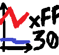

An open-source, free alternative to Vector CANalyzer for viewing CAN /
CAN-FD bus traffic on Windows, decoding it against DBC files, and graphing signals.

<p align="center">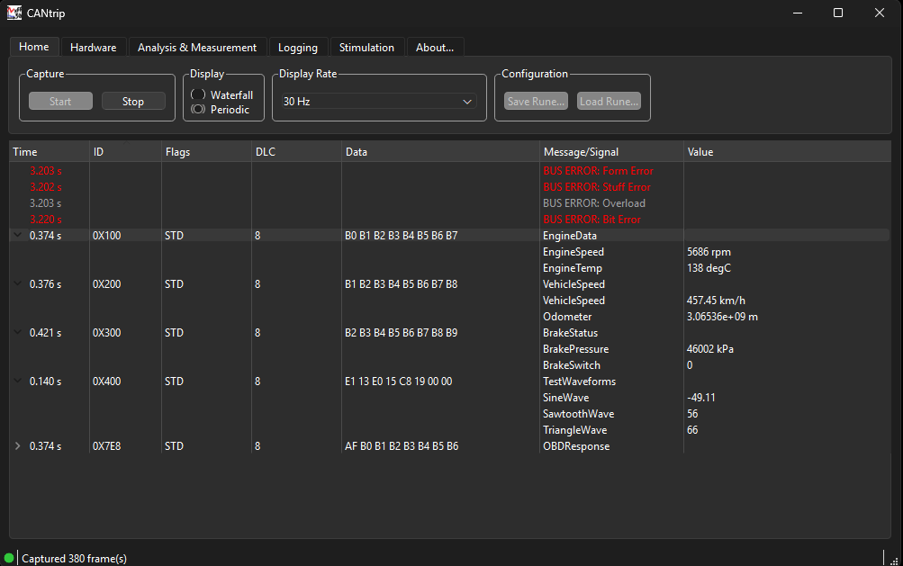</p>

## Why CANtrip

A Vector CANalyzer license costs anywhere from a few thousand to tens of
thousands of euros, putting it out of reach for students, hobbyists, and
small teams. The free/open-source alternatives, meanwhile, tend to be
CLI-first tools that expect you to memorize a dozen flags just to open a
bus, and reward a typo with a cryptic error three layers removed from
what actually went wrong. CANtrip aims to sit in the middle: a GUI tool
that's simple to pick up, powerful, free to use, and licensed GPLv3.


## Prerequisites (Windows)

- [Wireshark](https://www.wireshark.org/) installed 
- A driver package for whichever CAN hardware you're using. If you don't have any and just want to try it out; CANtrip ships with a synthetic CAN source to test its features.


## Running CANtrip

Prebuilt binaries are also published under
[Releases](https://github.com/avmolaei/CANtrip/releases) if you'd rather skip
building from source. 
Grab the zip, extract it anywhere, and copy the `can2pcap.exe` from CANtrip in your `$env:APPDATA\Wireshark\extcap\` Wireshark directory.

CANtrip's window is a ribbon, Office-style: each tab across the top shows a
different group of controls.

<p align="center"></p>

1. Launch `build\app\Debug\cantrip.exe` (or `cantrip.exe` from a Release
   zip).

2. On the **Hardware** tab, pick a channel from the "Network Hardware"
   dropdown. No CAN hardware or vendor driver installed yet? Pick
   **"CANtrip synthetic test source (no hardware needed)"**. It's always
   listed and fakes traffic so you can try everything below without owning
   a single wire.

   <p align="center">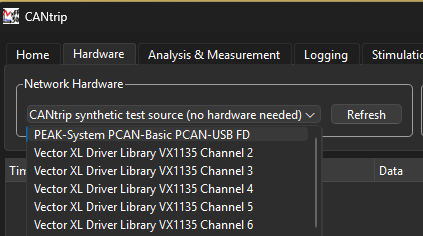</p>

3. Still on **Hardware**, click **CAN Controller...** to set the bitrate:
   classic `CAN` mode by default, or `ISO CAN FD`/`Expert CAN FD` for FD
   (synth source is CAN HS only). ISO mode computes real
   BRP/TSEG1/TSEG2/SJW register values live from a target bitrate and
   sample point; Expert mode lets you type those raw values directly.

   <p align="center">
     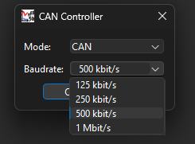
     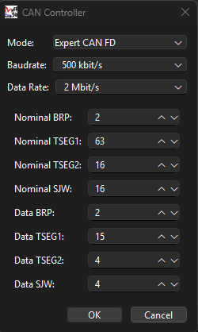
   </p>

   Don't know the actual settings of your bus? Autodetect scans your
   selected network hardware for its bus config and applies it:

   <p align="center">
     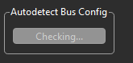
     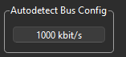
   </p>

4. On the **Home** tab, click **Start**. Frames stream into the table as
   they arrive; click the arrow next to a row to unfold it into its decoded
   signals (name, physical value, unit) via dbcppp. Switch between
   "Waterfall" (newest first) and "Periodic" (one row per ID) display from
   the same tab, and change the display rate in case of busy buses; click
   **Stop** to end the capture.

   <p align="center">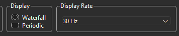</p>

5. On the **Analysis & Measurement** tab, click **Import DBC...** and load
   [`test/sample.dbc`](test/sample.dbc) - a small DBC whose four message IDs
   (`0x100`, `0x200`, `0x300`, `0x7E8`) deliberately match what the
   synthetic test source transmits, so you get fully decoded signals with
   zero hardware.

6. In this same tab, you can switch from the classic **CAN trace view** to
   a **graphical view**. Not much to explain, play around with it to get a
   hold of how it works:

   <p align="center">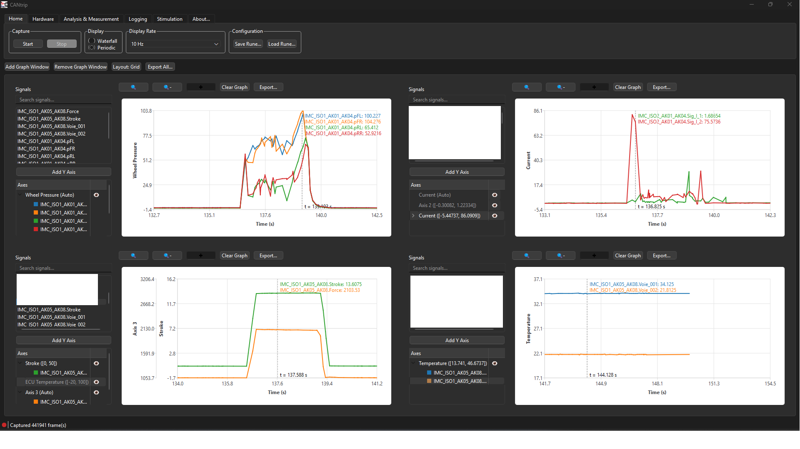</p>

7. Your environment is exactly how you like it and want to save it for
   later? Under the **Home** tab, press **Save Rune...**. Runes are
   CANtrip's configuration files - save and load them later so CANtrip
   remembers your bus configuration and graph layout.

   <p align="center">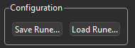</p>

8. Press Start once your environment is all set up and you'll see your
   frames, decoded signals, and any bus errors right in the trace view:

   <p align="center">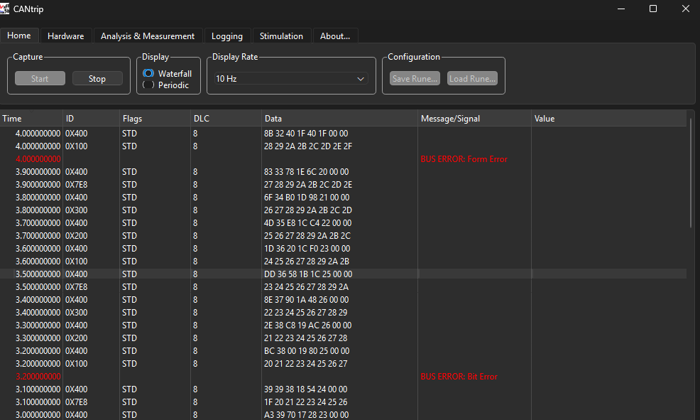</p>

## How it works

CANtrip does not reimplement CAN capture or low-level frame dissection.
Instead it reuses Wireshark's own capture pipeline:

```
CANtrip (Qt app) --launches--> tshark -T ek --reads from--> extcap: can2pcap
                                                                    |
                                                          AVlabs CAN backend
                                                          /       |        \
                                                   PeakBackend  VectorBackend  Other
                                                       |            |           HW
                                                PCAN-Basic.dll  vxlapi64.dll
                                                       |            |
                                                 PEAK hardware  Vector VN-series hardware
```

- **`extcap/can2pcap`** is a small Wireshark [extcap](https://www.wireshark.org/docs/wsdg_html_chunked/ChCaptureExtcap.html)
  program. It exposes CAN channels from any available backend as capture
  interfaces to Wireshark/tshark, translating frames into SocketCAN-format
  pcapng records so Wireshark's built-in SocketCAN dissector decodes
  ID/DLC/data/FD flags.
- **`app/`** is the Qt desktop application: pick a channel from any
  installed vendor, configure bus timing (usual presets or expert raw
  values), import a DBC per channel, and view live traffic in a table that
  unfolds into per-signal decoded values (via [dbcppp](https://github.com/xR3b0rn/dbcppp)).

Graphing, gateway mode, and message transmission are deferred to a later
phase.

### Multi-vendor hardware support

CANtrip is not tied to one CAN adapter vendor. There's no OS-level CAN
abstraction on Windows (unlike Linux's SocketCAN). Every vendor
ships its own proprietary DLL and API shape. CANtrip works around this with
a vendor-neutral interface, the **AVlabs CAN backend**
([`common/AVlabsCanBackend.h`](common/AVlabsCanBackend.h)); one bus to sniff
them all.
The extcap and app only ever talk to that interface, never to a
vendor SDK directly.

- Each backend dynamically loads its vendor's DLL at runtime
  (`LoadLibrary`/`GetProcAddress`), so CANtrip builds and runs fine with
  only some (or none) of the vendor SDKs installed.
- [`common/PeakBackend.h/.cpp`](common/PeakBackend.cpp) wraps PEAK-System's
  `PCANBasic.dll`. Supports classic CAN and CAN FD.
- [`common/VectorBackend.h/.cpp`](common/VectorBackend.cpp) wraps Vector
  Informatik's `vxlapi64.dll` (XL Driver Library), verified against a VN1640A and a VN7640. Supports classic CAN and CAN FD, with bit timing computed by
  [`common/CanBitTiming.h/.cpp`](common/CanBitTiming.cpp) 
- [`common/CanBackendRegistry.cpp`](common/CanBackendRegistry.cpp) is the
  single place that lists every backend CANtrip knows about.
- Adding support for another vendor (Kvaser's CANlib, ETAS's BOA, etc.)
  means implementing the AVlabs CAN backend interface once, using that
  vendor's real SDK header and adding one
  line to the registry.

  
## Building CANtrip

### Build process

```powershell
cmake -S . -B build -DCMAKE_PREFIX_PATH="G:\Qt\6.7.3\msvc2019_64"
cmake --build build --config Debug
```

This produces:
- `build\extcap\Debug\can2pcap.exe`
- `build\app\Debug\cantrip.exe`

### Installing the extcap into Wireshark

After installing Wireshark and downloading CANtrip, copy `can2pcap.exe` into Wireshark's personal extcap folder
so both Wireshark and `tshark` (and therefore CANtrip) can see it:

```powershell
copy build\extcap\Debug\can2pcap.exe "$env:APPDATA\Wireshark\extcap\"
```

Verify it's picked up:

```powershell
tshark -D
```

You should see a `can2pcap` interface listed.


## Contributing

See [CONTRIBUTING.md](CONTRIBUTING.md) for code conventions and
how to verify changes. See [RELEASING.md](RELEASING.md) for the version
naming scheme and how a release gets cut.

## License

GPL-3.0. See [LICENSE](LICENSE). CANtrip statically/dynamically links
[dbcppp](https://github.com/xR3b0rn/dbcppp) (MPL-2.0) and shells out to
Wireshark's `tshark` (GPL-2.0) as a separate process — see individual
project licenses for details.

Vector, CANalyzer, and CANoe are trademarks of Vector Informatik GmbH.
CANtrip is an independent, unaffiliated open-source project and is not
endorsed by or affiliated with Vector Informatik.
