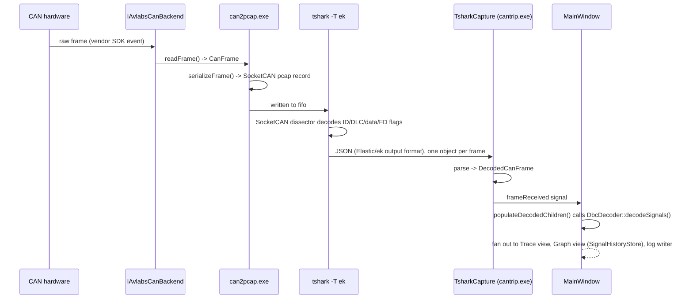

# Data Flow

How one CAN frame actually gets from a bit on the wire to a decoded signal
on screen (or a logged line, or a plotted point):

## Where each responsibility actually lives

- **Backend → `can2pcap.exe`**: `readFrame()` is documented and used as
  non-blocking - it returns immediately whether or not a frame arrived,
  and `can2pcap.exe`'s capture loop sleeps briefly when idle rather than
  blocking. See [The AVlabs CAN Backend](can-backend-abstraction.md).
- **`can2pcap.exe`**: the *only* place that knows about the SocketCAN wire
  format. This is also where the CAN FD DLC-code-to-byte-length
  translation happens - see the note on `CanFrame::dlc` in
  [The AVlabs CAN Backend](can-backend-abstraction.md#the-dlc-code-vs-byte-length-trap).
- **`tshark`**: does the actual low-level frame dissection (ID/DLC/data/FD
  flags), using Wireshark's own built-in SocketCAN dissector. CANtrip
  never re-implements this.
- **`TsharkCapture`** (`app/TsharkCapture.cpp`): parses `tshark`'s JSON
  output into a `DecodedCanFrame` - CANtrip's own in-process frame
  representation, distinct from the wire-level `CanFrame` struct backends
  use.
- **`DbcDecoder`** (`app/DbcDecoder.h/.cpp`): DBC load + signal decode -
  a plain, non-GUI class (extracted out of `MainWindow` specifically so
  [headless mode](../headless-mode.md) could reuse it
  without a `MainWindow` to host it).
- **`MainWindow`**: calls `DbcDecoder` from `populateDecodedChildren()`
  and fans the result out to every view/writer that cares about it
  (Trace, Graph, log file) - the GUI-specific part (building
  `QTreeWidgetItem`s, feeding `SignalHistoryStore`) is all that's left
  here now.

## The transmit side feeds the same pipeline

[`MessageSender`](send-message-internals.md)'s `frameSent` signal connects
straight to the same `onFrameReceived` slot a live capture's
`frameReceived` signal does - a frame CANtrip itself transmits gets
logging, Trace/Graph display, and DBC decode entirely for free, with no
separate code path. It's marked as `Tx`-direction so it can be visually
distinguished (see [Stimulation Tab](../user-guide/stimulation-tab.md#received-pane)),
but it flows through exactly the same machinery.

## Replay feeds it too

[`LogReplaySource`](logging-and-replay.md) also connects to the same
`onFrameReceived` slot as `TsharkCapture` and `MessageSender` - see
[Logging & Replay](logging-and-replay.md).
