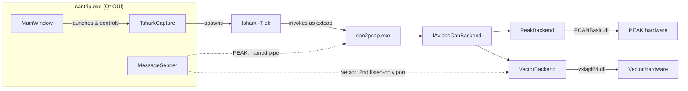

# Process Architecture

CANtrip does not reimplement CAN capture or low-level frame dissection.
Instead it reuses Wireshark's own capture pipeline end to end: `tshark`
launches `can2pcap.exe` as an [extcap](https://www.wireshark.org/docs/wsdg_html_chunked/ChCaptureExtcap.html)
program, which talks to a vendor-neutral hardware abstraction that in turn
talks to whichever vendor SDK is actually installed.

## Why route through Wireshark at all

`can2pcap.exe` translates whatever it reads from a CAN backend into
SocketCAN-format pcapng records, and writes them to a fifo `tshark` reads
from. Wireshark's own built-in SocketCAN dissector already knows how to
decode CAN ID / DLC / data / FD flags from that format for free - CANtrip
gets a correct, well-tested low-level decoder without writing or
maintaining one itself. CANtrip's own DBC layer adds signal-level decode
strictly on top of that, in `MainWindow`, not in `can2pcap.exe`.

`can2pcap.exe` running independently and correctly is also what makes it
possible to drive the whole capture pipeline from the command line with no
Qt/GUI involved at all - see [Headless Mode](../headless-mode.md).

## The two Send Message paths

The dotted lines above are [Send Message's](../user-guide/stimulation-tab.md)
transmit path, and they're genuinely different per vendor, not a stylistic
choice:

- **Vector**: `MessageSender` opens a second port directly on the same
  channel with a zero permission mask (listen-only), and writes frames on
  that port itself. `cantrip.exe` never needs `can2pcap.exe`'s cooperation
  to transmit.
- **PEAK**: PCAN-Basic has no equivalent to that permission-mask concept -
  there's no way to open a second handle onto a channel `can2pcap.exe`
  already initialized. So `MessageSender` instead connects to a named pipe
  `can2pcap.exe` itself creates, and `can2pcap.exe` writes the frame out on
  the one handle it already owns.

The full mechanism, including exactly why the naive "just open a second
PEAK handle" approach fails, is in
[Send Message Internals](send-message-internals.md).

## Multi-vendor hardware support

There's no OS-level CAN abstraction on Windows (unlike Linux's SocketCAN) -
every vendor ships its own proprietary DLL and API shape. CANtrip works
around this with a vendor-neutral interface, **the AVlabs CAN backend**
(`common/AVlabsCanBackend.h`); one bus to sniff them all. Both
`can2pcap.exe` and `cantrip.exe` only ever talk to that interface, never to
a vendor SDK directly. See
[The AVlabs CAN Backend](can-backend-abstraction.md) for the interface
itself, and [`CONTRIBUTING.md`](https://github.com/avmolaei/CANtrip/blob/main/CONTRIBUTING.md#adding-a-new-vendor-backend)
for how to add support for a new vendor.
