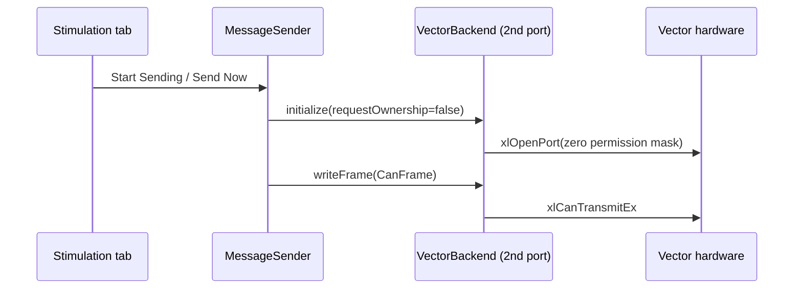

# Send Message Internals

[`MessageSender`](../user-guide/stimulation-tab.md) is a plain, non-GUI
`QObject` that owns the transmit side of Send Message: the cyclic scheduler
and the actual write path. It picks between two fundamentally different
mechanisms per vendor, `SendMode::DirectBackend` or `SendMode::NamedPipe`,
decided once in `openPort()` based on which backend matches the selected
channel.

## Why two mechanisms at all

Vector's XL Driver Library has a real permission-mask concept: a port
opened with a zero permission mask joins a channel without requesting
configuration rights, as a genuine second, independent handle. So Vector's
path is simple - `MessageSender` just opens a second listen-only port
directly on the same channel and calls `writeFrame()` on it.



PCAN-Basic (PEAK's driver) has **no equivalent**. There is no second-handle
path onto a channel another process already initialized, full stop -
confirmed for real: a second `CAN_Initialize()` call on an already-active
PEAK channel returns `PCAN_ERROR_INITIALIZE`. The only process holding a
valid PEAK handle is `can2pcap.exe` itself (it already called
`CAN_Initialize()` to start capturing). So transmit has to be routed
*through* `can2pcap.exe`, not around it:

```mermaid
sequenceDiagram
    participant UI as Stimulation tab
    participant MS as MessageSender
    participant Pipe as named pipe\ncantrip_tx_&lt;interfaceId&gt;
    participant CP as can2pcap.exe
    participant HW as PEAK hardware

    Note over CP: capture loop already running,<br/>already holds the one valid handle
    CP->>Pipe: CreateNamedPipeA (PIPE_NOWAIT)
    UI->>MS: Start Sending / Send Now
    MS->>Pipe: CreateFileA (connect as client)
    MS->>Pipe: WriteFile(raw CanFrame bytes)
    CP->>Pipe: ReadFile (polled each loop iteration)
    CP->>HW: CAN_Write / CAN_WriteFD (on its own handle)
```

The pipe carries raw `CanFrame` bytes with no serialization scheme - both
processes are built from the same header by the same compiler in the same
CMake project, so there's no cross-ABI risk, and writing/reading
`sizeof(CanFrame)` bytes directly is simplest. The server side
(`can2pcap.exe`) uses `PIPE_NOWAIT` rather than overlapped I/O, keeping its
existing simple synchronous polling capture loop intact instead of
introducing threads for what's a low-frequency, low-stakes internal
control channel.

## Why the port opens lazily

`MessageSender::openPort()` is only called on the *first actual* Start
Sending/Send Now click, not automatically when a capture starts. Opening
it automatically raced against `tshark`/`can2pcap.exe` actually finishing
their own startup (DLL load, channel resolve, `CAN_Initialize`, pipe
creation) - `capture_.isRunning()` in the GUI only reflects `tshark`'s own
process state, not whether the further child process `can2pcap.exe` has
gotten that far yet. This caused a real, confirmed bug: a near-simultaneous
second `CAN_Initialize()` call reset/conflicted with the channel PEAK
capture had just set up, killing a live capture outright. The PEAK pipe
client path also retries connecting for a couple of seconds to absorb this
same startup latency rather than failing on the very first attempt.

## The DLC conversion applies before either path

Both `SendMode`s carry a `TransmitMessage` (byte-length `dlc`) that must be
converted to a `CanFrame` (DLC-code `dlc`) before transmission - see
[The AVlabs CAN Backend: the DLC code vs byte length trap](can-backend-abstraction.md#the-dlc-code-vs-byte-length-trap).
This conversion happens once, in `MessageSender::transmitOne()`, before the
`SendMode` branch, since it's about the payload itself, not how it's
delivered.
