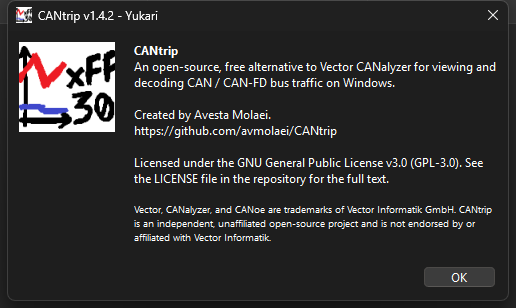

# About Tab

**About CANtrip...** opens a dialog with the current version and codename
(`CANtrip vX.X.X - Codename`, see [RELEASING.md](https://github.com/avmolaei/CANtrip/blob/main/RELEASING.md)
for the version/codename scheme), license, and a trademark disclaimer.

CANtrip statically/dynamically links [dbcppp](https://github.com/xR3b0rn/dbcppp)
(MPL-2.0) and shells out to Wireshark's `tshark` (GPL-2.0) as a separate
process. CANtrip itself is GPL-3.0. Vector, CANalyzer, and CANoe are
trademarks of Vector Informatik GmbH; CANtrip is an independent,
unaffiliated project and is not endorsed by or affiliated with Vector
Informatik.
