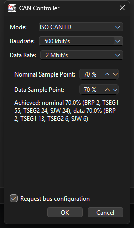

# Hardware Tab

## Network Hardware

The dropdown lists every CAN channel CANtrip could find, across every
vendor SDK actually installed on the machine, plus the always-available
synthetic test source (see [Getting Started](getting-started.md#try-it-with-no-hardware-at-all)).
**Refresh** re-scans if you plugged in hardware after launching CANtrip.

CANtrip isn't tied to one CAN adapter vendor - see
[Architecture: The AVlabs CAN Backend](../architecture/can-backend-abstraction.md)
for how that actually works.

## CAN Controller

Click **CAN Controller...** to configure bus timing. Three modes:

- **CAN** (classic) - just a bitrate preset (125k/250k/500k/1M).
- **ISO CAN FD** - real BRP/TSEG1/TSEG2/SJW register values computed live
  from a target nominal/data bitrate and a target sample point, using the
  same algorithm python-can's bit-timing calculator uses.
- **Expert CAN FD** - type those raw register values in directly, for a
  bus whose timing someone already specified in exact register terms.

{ width="300" }
{ width="300" }

Bus timing set here only takes effect the *next* time a capture starts, not
live against an already-running capture.

### Request bus configuration

The checkbox at the bottom of the dialog, checked by default, controls
whether CANtrip asks for exclusive configuration rights on the channel:

- **Checked** (default): today's normal behavior. CANtrip configures the
  bus (bitrate/timing) itself when the capture starts.
- **Unchecked** (listen-only): CANtrip joins the channel *without*
  requesting configuration rights, assuming another application (a
  diagnostics tool, another instance of CANtrip on a different machine,
  etc.) has already configured it. This is the same idea as real
  CANalyzer's "Init Access" checkbox, for the same reason: letting more
  than one tool observe a live bus at once without them fighting over who
  configures it.

Vector and PEAK hardware support this very differently under the hood -
see [Architecture: Send Message Internals](../architecture/send-message-internals.md)
for why unchecking this matters more on PEAK than it might seem.

This setting is saved in [Runes](runes.md).

## Autodetect Bus Config

Don't know your bus's actual bitrate? **Autodetect** scans the selected
hardware against the common classic-CAN presets and applies whichever one
comes back clean.

This only works for classic CAN bitrates today, not CAN FD timing.
