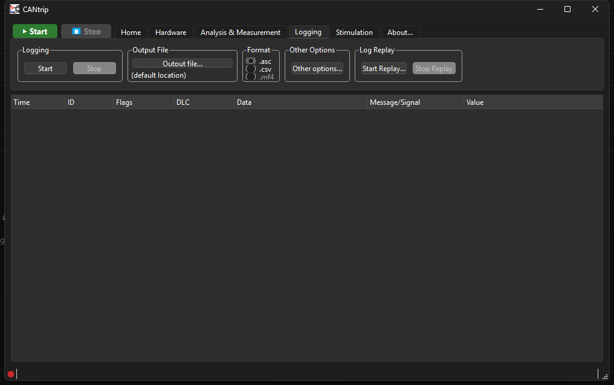
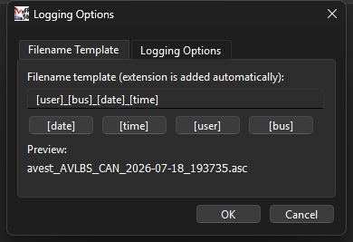
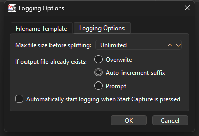

# Logging Tab

## Logging

**Start** / **Stop** record every frame CANtrip sees to a file, independent
of the display-rate throttle described in [Home Tab](home-tab.md#display-rate) -
logging always sees every single frame, never a throttled subset.

## Output File

Pick a destination file. The actual filename gets built from a template -
see [Other Options](#other-options) below - so this is really about picking
a folder plus a base pattern, not one fixed exact filename.

## Format

- **.asc** - a CANalyzer-compatible baseline ASCII trace format. Good
  default if you want the log readable by other CAN tools.
- **.csv** - a flat CSV with one row per frame: `Time, Channel, ID,
  Direction, Extended, FD, BRS, ESI, RTR, DLC, Data, MessageName, Error`.
  `Direction` is `Rx` or `Tx` - frames CANtrip itself transmitted via
  [Stimulation](stimulation-tab.md) log the same as received ones, just
  tagged.
- **.mf4** - real ASAM MDF4. **Not implemented yet** ("Coming soon" in the
  UI, the radio is disabled) - a genuinely bigger undertaking than ASC/CSV,
  planned but not scheduled to a specific version.

## Other Options

**Other options...** opens a two-tab dialog:

**Filename Template** - build the actual filename from placeholders
(`[date]`, `[time]`, `[user]`, `[bus]`), with a live preview of what the
real filename will look like. The extension is added automatically based
on the Format selection above.

**Logging Options** - the rest:

- **Max file size before splitting** - "Unlimited", or a size that
  auto-splits the log into multiple files once exceeded.
- **If output file already exists** - Overwrite, Auto-increment suffix (the
  default), or Prompt.
- **Automatically start logging when Start Capture is pressed** - skips
  the separate manual Start click on this tab.

## Log Replay

**Start Replay...** loads a previously-saved log file back through the
exact same pipeline a live capture uses - Trace view, Graph view, and
decode all behave identically, there's no separate "replay mode" logic to
learn. **Stop Replay** ends it early. See
[Architecture: Logging & Replay](../architecture/logging-and-replay.md) for
why this works with zero special-casing.
