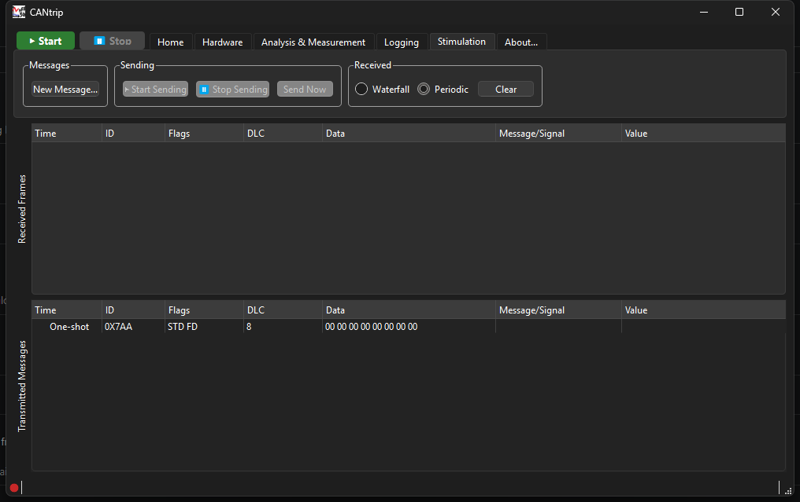
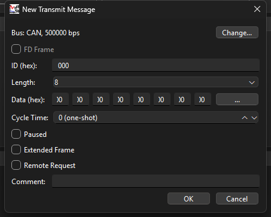
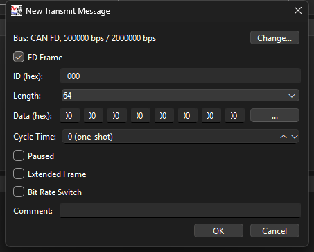
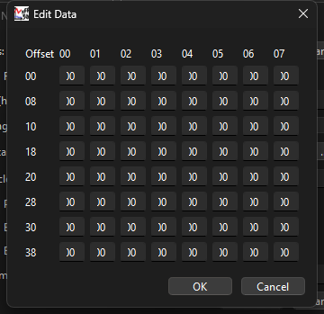

# Stimulation Tab

The Stimulation tab is CANtrip's message-transmission workspace, modeled on
PEAK's PCAN-View: a split view with received frames on top and your
configured transmit messages below, plus the controls to send them.

## New Message

**New Message...** opens the New Transmit Message dialog:

- **Bus** - shows the currently-configured bus (read-only here; **Change...**
  jumps to the [Hardware tab](hardware-tab.md) to actually change it).
- **FD Frame** - only enabled if the configured bus is CAN FD-capable, and
  **defaults to checked when it is**. Toggling it swaps Remote Request for
  Bit Rate Switch (mutually relevant only to their respective frame types)
  and changes what Length offers.
- **ID (hex)** - the CAN identifier.
- **Length** - `0`-`8` for classic frames; with FD Frame checked, the full
  FD length set: `0, 1, 2, ..., 8, 12, 16, 20, 24, 32, 48, 64`.
- **Data (hex)** - the first 8 bytes inline; click **...** for the full
  grid on longer FD frames (below).
- **Cycle Time** - `0` sends the message once ("one-shot") whenever you
  press Send Now or Start Sending; anything higher repeats it on that
  interval (ms) while sending is active.
- **Paused** - excludes this message from the cyclic scheduler without
  deleting it; Send Now still fires it regardless.
- **Extended Frame** / **Remote Request** (classic) or **Bit Rate Switch**
  (FD) - standard CAN flags.
- **Comment** - free text, shown in the message list.

### Edit Data

With FD Frame checked and a Length over 8, click **...** to open a full hex
grid instead of typing into 8 inline boxes. It resizes to match the
selected length: 8 bytes per row, so Length 16 shows 2 rows, Length 32
shows 4, Length 64 shows the full 8.

## Sending

- **Start Sending** - enables the cyclic scheduler: every non-paused
  message with a cycle time above 0 starts firing on its own interval.
  Only enabled while a capture is actually running.
- **Stop Sending** - pauses the scheduler (the port stays open; pressing
  Start Sending again resumes immediately, no reconnect delay).
- **Send Now** - fires the currently-selected message(s) once immediately,
  regardless of the scheduler or their individual Paused state.

The very first Start Sending or Send Now click in a capture session opens
the actual transmit port, which can briefly fail if the capture hasn't
fully finished starting up yet - see
[Architecture: Send Message Internals](../architecture/send-message-internals.md)
if you want the real reason why, and
[Troubleshooting](troubleshooting.md) if it's failing outright rather than
just being briefly unavailable.

## Message list

Right-click a message for **Edit**, **Send Now**, **Copy**, **Cut**,
**Paste**, **Delete**, and **Clear All** (asks for confirmation - this
deletes every configured message). Double-click a row to edit it directly.

## Received pane

The top pane behaves like a smaller version of the main
[Trace view](analysis-and-measurement-tab.md#trace-vs-graph-view), with its
own independent controls:

- **Waterfall / Periodic** toggle, same meaning as the
  [Home tab's](home-tab.md#display) version but scoped to just this pane -
  defaults to Periodic specifically so a fast cyclic Start Sending doesn't
  flood this pane with a new row per send.
- **Clear** - clears just this pane, without touching your configured
  transmit messages.

Frames CANtrip itself transmits flow through the exact same pipeline real
received frames do (so they get decoded, logged, and graphed identically),
but they're **marked**: a `TX` tag in the Flags column and a light-blue
row color, so your own sends stay visually distinguishable from genuine bus
traffic in this pane and in the main Trace view alike.
